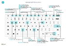

# Hurtig reference til tastatur - kun pc'er

#### Generelt

|Vælg disse taster|For at gøre følgende|  
|-|-|
|<kbd>Alt</kbd>|Vis hurtigtaster til at navigere mellem handlingslinjen eller navigationsmenuen|
|<kbd>Alt</kbd>+<kbd>F2</kbd>|Vise eller skjule faktaboksruden|
|<kbd>Alt</kbd>+<kbd>N</kbd>|Oprette en ny post|
|<kbd>Alt</kbd>+<kbd>Skift</kbd>+<kbd>N</kbd>|Lukke en nyoprettet post og åbne en ny|
|<kbd>Alt</kbd>+<kbd>O</kbd>|Føje en ny note til den valgte post|
|<kbd>Alt</kbd>+<kbd>Q</kbd>|Åbn **Fortæl mig**|
|<kbd>Ctrl</kbd>+<kbd>Alt</kbd>+<kbd>Q</kbd>|Åbn **Find poster**|
|<kbd>Alt</kbd>+<kbd>Op</kbd>|Åbn værktøjstip eller valideringsfejl|
|<kbd>Alt</kbd>+<kbd>Pil ned</kbd>|Åbn en rullemenu eller et opslag|
|<kbd>Ctrl</kbd>+<kbd>Alt</kbd><kbd>Pil ned</kbd>|Åbne en relateret posts kort eller listeside filtreret til værdien i opslags- eller assisteret redigeringsfelt|
|<kbd>Alt</kbd>+<kbd>T</kbd>|Åbn siden **Mine indstillinger**|
|<kbd>Alt</kbd>+<kbd>Skift</kbd>+<kbd>W</kbd>|Åbne det aktuelle kort eller dokument i et nyt vindue|
|<kbd>Ctrl</kbd>+<kbd>Indsæt</kbd>|Indsætte en ny linje i et dokument|
|<kbd>Ctrl</kbd>-<kbd>Slet</kbd>|Slette linjen i et dokument, en kladde eller et regneark|
|<kbd>Ctrl</kbd>+<kbd>Skift</kbd>+<kbd>F12</kbd>|Maksimere delen med linjevarer på en dokumentside|
|<kbd>Ctrl</kbd>+<kbd>F1</kbd>|Åbner ruden hjælp eller en artikel i hjælp|
|<kbd>Ctrl</kbd>+Klik|Navigere under tilpasning|
|<kbd>Ctrl</kbd>+<kbd>O</kbd>|Skifte firma eller miljø|
|<kbd>Skift</kbd>+<kbd>F12</kbd>|Åbn Rollestifinder, en funktionsoversigt|
|<kbd>F5</kbd>/<kbd>Ctrl</kbd>+<kbd>F5</kbd>|Opdater/genindlæs side|
|<kbd>Tab</kbd>/<kbd>Skift</kbd>+<kbd>Tab</kbd>|Flytte fokus til næste/forrige element|
|<kbd>F6</kbd>/<kbd>Skift</kbd>+<kbd>F6</kbd>|Flyt til næste oversigtspanel/del|

#### Naviger og vælg rækker

|Vælg disse taster|For at gøre følgende|
|-|-|
|<kbd>Home eller End|Gå til det første eller sidste felt|
|<kbd>Ctrl</kbd>+<kbd>Start</kbd>/<kbd>End</kbd>|Gå til den første eller sidste række|
|<kbd>Ctrl</kbd>+<kbd>Op</kbd>/<kbd>Ned</kbd>|Navigere uden at miste markering|
|<kbd>Ctrl</kbd>+<kbd>A</kbd>|Markér alt|
|<kbd>Ctrl</kbd>+<kbd>Mellemrumstast</kbd>|Skifte markering af række|
|<kbd>Ctrl</kbd>/<kbd>Skift</kbd>+Klik|Føje rækken/rækkerne til markeringen|
|<kbd>Skift</kbd>+<kbd>Op</kbd>/<kbd>Ned</kbd>|Føje rækken over/under til markering|
|<kbd>Skift</kbd>+<kbd>Side op</kbd>/<kbd>Ned</kbd>|Vælg synlige rækker over/under|
|<kbd>Ctrl</kbd>+<kbd>Enter</kbd>|Fokusere uden for listen|

#### Kopiér og sæt ind

|Vælg disse taster|For at gøre følgende|
|-|-|
|<kbd>Ctrl</kbd>+<kbd>C</kbd>/<kbd>V</kbd>|Kopiér/Indsæt rækker|
|<kbd>F8</kbd>|Kopiere feltet ovenover til den aktuelle række|

#### Søg, filtrer og sortér

|Vælg disse taster|For at gøre følgende|
|-|-|
|<kbd>Alt</kbd>+<kbd>F7</kbd>|Sortér kolonnen i stigende eller faldende rækkefølge|
|<kbd>F3</kbd>|Skifte søgning|
|<kbd>Skift</kbd>+<kbd>F3</kbd>|Skifte filterrude, fokusere på feltfiltre|
|<kbd>Alt</kbd>+<kbd>F3</kbd>|Filtrere på den markerede celleværdi|
|<kbd>Skift</kbd>+<kbd>Alt</kbd>+<kbd>F3</kbd>|Tilføje filter i markeret felt|
|<kbd>Ctrl</kbd>+<kbd>Alt</kbd>+<kbd>Skift</kbd>+<kbd>F3</kbd>|Nulstil filtre|

#### Genvej

|Vælg disse taster|For at gøre følgende|
|-|-|
|<kbd>Ctrl</kbd>+<kbd>Skift</kbd>+<kbd>Enter</kbd>|Gå til næste genvejsfelt uden for en liste|
|<kbd>Enter</kbd>/<kbd>Skift</kbd>+<kbd>Enter</kbd>|Gå til næste/forrige genvejsfelt|

##### Visning af et rapporteksempel

|Vælg disse taster|For at gøre følgende|
|-|-|
|<kbd>Ctrl</kbd>+<kbd>Start</kbd>/<kbd>End</kbd>|Gå til første/sidste side|

#### Numerisk tastatur

|Vælg disse taster|For at gøre følgende|  
|-|-|
|<kbd>Alt</kbd>+<kbd>Decimalseparator</kbd>|Slå decimalseparator output til/fra på numerisk tastatur|

> [!TIP]
> Hvis du vil have en grafisk printervenlig version, skal du vælge følgende billede og hente PDF-filen.
>
> 

[!INCLUDE[footer-include](includes/footer-banner.md)]
