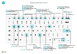

# TastaturgenvejeKeyboard Shortcuts

Denne artikel indeholder en oversigt over nogle af de tastaturgenvejskombinationer, du kan bruge, når du arbejder med [!INCLUDE[prod_short](includes/prod_short.md)].This article provides an overview of some of the shortcut key combinations that you can use when you're working with [!INCLUDE[prod_short](includes/prod_short.md)].

Du kan finde en oversigt over de mest populære tastaturgenveje under [Tastaturgenveje (kun pc)](keyboard-shortcuts-cheatsheet.md).For an overview of the most popular keyboard shortcuts, see [Keyboard Shortcuts (PC only)](keyboard-shortcuts-cheatsheet.md).

> [!TIP]
> Hvis du vil have vist en grafisk oversigt over de mest benyttede genveje, skal du vælge følgende billede og hente PDF-filen.For a graphical view of the most used shortcuts, choose the following image and download the PDF file.  
> 

## OversigtOverview

Tastaturgenveje giver større tilgængelighed, hvilket kan gøre det lettere og mere effektivt at navigere til forskellige områder og elementer på en side.Keyboard shortcuts aid accessibility and can make it easier and more efficient to navigate to different areas and elements on a page. Genvejene understøttes af de fleste webbrowsere, men funktionsmåden kan variere en smule.They're supported by most web browsers, however, the behavior may vary slightly.

> [!NOTE]
> De tastaturgenveje, der beskrives her, henviser til et amerikansk tastaturlayout.The keyboard shortcuts described here refer to the U.S. keyboard layout. Tasterne kan være anderledes på andre tastaturlayout.The layout of the keys on other keyboards may not correspond exactly to the keys on a U.S. keyboard.

De fleste genveje er de samme, uanset om operativsystemet er Windows eller macOS.Most of the shortcuts are the same whether the operating system is Windows or macOS. Nogle genveje adskiller sig dog fra genvejene i macOS.However, some shortcuts differ for macOS. Disse genveje er angivet i parentes i de følgende afsnit.These shortcuts are indicated with brackets in the following sections.

> [!NOTE]
> Ud over de globale tastaturgenveje, der er beskrevet i dette emne, er der en række tilgængelige forretningsspecifikke genveje.In addition to the global keyboard shortcuts described in this topic, a number of business-specific shortcuts are available. I f.eks. den generiske version af [!INCLUDE[prod_short](includes/prod_short.md)] bogfører F9 et dokument, og Ctrl+F7 viser de finansielle posteringer for en post, når du åbner posten i et kort.For example, in the generic version of [!INCLUDE[prod_short](includes/prod_short.md)], F9 posts a document and Ctrl+F7 shows the ledger entries for a record when you open the record in a card. (Disse kan være anderledes i din løsning). Tastaturgenvejene vises i værktøjstippet for den pågældende handling.(These may be different in your solution.) The keyboard shortcut is shown in the tooltip for the action in question.

##   Generelle tastaturgenvejeGeneral Keyboard Shortcuts

I følgende tabel beskrives tastaturgenveje, der kan bruges til navigation og adgang til forskellige elementer på en side.The following table describes keyboard shortcuts for navigating and accessing different elements of a page. Elementer omfatter ting som handlinger, rullelister, opslag og meget mere.Elements include things like actions, drop-down lists, lookups, and more. Du kan finde oplysninger om tastaturgenveje til navigation mellem poster, når du er på en liste, i næste afsnit.For details about keyboard shortcuts for navigating records once you get inside a list, see the next section.

|Tryk på disse tasterPress these keys (i macOS)(in macOS)|For at gøre følgendeTo do this|
|--------------------------------|----------|
|Alt+Pil nedAlt+Down Arrow|Åbne en rulleliste eller slå en værdi for et felt op.Open a drop-down list or look up a value for a field.|
|Alt+Pil opAlt+Up Arrow|Vise værktøjstip for et felt eller en kolonneoverskrift i en tabel.Show tooltip for a field or a column header of a table. Hvis feltet indeholder valideringsfejl, skal du trykke på Alt + pil op for at få vist valideringsfejlen.If the field has validation errors, press Alt+Up Arrow to show the validation error. Tryk på Esc eller Alt+pil op for at lukke værktøjstippet.Press Esc or Alt+Up Arrow to close the tooltip.|
|F2F2|Du kan skifte mellem at markere hele feltværdien eller placere markøren i slutningen af feltets værdi.Toggle between selecting the entire field value or placing the cursor at the end of the field value.|
|Alt+F2Alt+F2|Vise eller skjule faktaboksruden.Show and hide the FactBox pane.|
|Alt+Skift+F2Alt+Shift+F2|Skifte mellem **Detaljer** og **Vedhæftede filer** i faktaboksruden.Shift between **Details** and **Attachments** in the FactBox pane.|
|Alt+OAlt+O|Du kan tilføje en ny note i den valgte post, også selvom faktaboksruden ikke er åben.Add a new note for the selected record, even if the FactBox pane isn't open.|
|ALT + QAlt+Q (Ctrl+option+Q)(Ctrl+Option+Q)|Åbne vinduet **Fortæl mig**.Open the **Tell Me** window. Du kan finde flere oplysninger i [Søge efter sider og oplysninger med Fortæl mig](ui-search.md).For more information, see [Finding Pages and Information with Tell Me](ui-search.md).|
|Alt+NAlt+N |Åbne en side for at oprette en ny post.Open a page to create a new record. (Svarer til at vælge **Ny** og **+**-handlinger).(Similar to choosing the **New** and **+** actions.)|
|Alt+Skift+NAlt+Shift+N |Lukke en nyoprettet side og åbne en ny for at oprette en ny post.Close a newly created page and open a new one to create a new record. På samme måde bogfører Alt+F9 et dokument og opretter et nyt.Similarly, Alt+F9 posts a document and creates a new one.|
|Alt+TAlt+T|Åbne siden **Mine indstillinger**.Open the **My Settings** page.|
|Alt+HøjrepilAlt+Right Arrow|Finde yderligere oplysninger eller underliggende værdier for et felt, der indeholder knappen .Look up additional information or underlying values for a field that contains the  button. Dette bruges, når den sædvanlige rullemenuknap (Alt + pil ned) i det samme felt bruges til andre formål.This is used when the usual drop-down button (Alt+Down Arrow) in the same field is used for another purpose.|
|Ctrl+Alt+Skift+CCtrl+Alt+Shift+C|Få vist oplysninger på virksomhedskortet.Display information in the company badge.|
|Ctrl+Alt+F1Ctrl+Alt+F1|Åbne og lukke sideinspektionsruden.Open and close the page inspection pane. Sideinspektionsruden viser oplysninger om siden, f.eks. dens kildetabel, felter, udvidelser og meget mere.The page inspection pane shows information about the page, like its source table, fields, filters, extensions, and more.  Du kan finde flere oplysninger i [Inspektion af sider](across-inspect-page.md).For more information, see [Inspecting Pages](across-inspect-page.md).|
|Ctrl+CCtrl+C |Kopiere værdien i feltet.Copy the value of field. Hvis feltet er i fokus, og du ikke har markeret tekst i feltet, kopieres hele værdien.If the field is in focus, and you haven't selected any text in the field, this will copy the entire value. Hvis du har markeret tekst i feltet, så kopieres kun den markerede tekst.If you've selected any text in the field, then it will copy the selected text only.|
|Ctrl+F1Ctrl+F1|Åbne hjælpen til Business Central for siden.Open the Business Central help for the page.|
|Ctrl+F12Ctrl+F12|Skifte mellem visning med bredt og smalt layout.Switch between wide and narrow layout view.|
|Ctrl+klikCtrl+Click|Navigere under tilpasning, når handlingen er fremhævet med en pilespids.Navigate during personalizing or customizing when the action is highlighted with an arrowhead. Du kan finde flere oplysninger i [Tilpasse dit arbejdsområde](ui-personalization-user.md).For more information, see [Personalize Your Workspace](ui-personalization-user.md).|  
|Ctrl+F5Ctrl+F5|Genindlæse [!INCLUDE[prod_short](includes/prod_short.md)]-programmet.Reload the [!INCLUDE[prod_short](includes/prod_short.md)] application. (Svarer til at vælge opdater/genindlæs i browseren).(Similar to selecting refresh/reload in the browser.)|
|F5F5|Opdatere oplysningerne på den aktuelle side.Refresh the data on the current page.  Du kan bruge denne tast til at sikre, at dataene på siden er opdateret med de ændringer, der er foretaget af andre, mens du arbejder.Use this key to ensure that the data on the page is up to date with any changes that others have made while you're working.|
|IndsætEnter|Aktivere eller få adgang til det element eller kontrolelement, der er i fokus.Enable or access the element or control that is in focus.|
|EscEsc|Lukke den aktuelle side eller rullelisten.Close the current page or drop-down list.|
|TabTab|Flytte fokus til det næste kontrolelement eller objekt på en side, f.eks. handlinger, knapper, felter eller listeoverskrifter.Move focus to the next control or element on a page, such as actions, buttons, fields, or list headings.|
|Skift+TabShift+Tab|Flytte fokus til det forrige kontrolelement eller objekt på en side, f.eks. handlinger, knapper, felter eller listeoverskrifter.Move focus to the previous control or element on a page, such as actions, buttons, fields, or list headings.|
|J og NY and N|Aktivere knapperne **Ja** og **Nej** i dialogbokse.Activate **Yes** and **No** buttons in dialog boxes. De aktuelle nøgler varierer, alt efter det aktuelle sprog der er angivet i **Mine indstillinger**.Actual keys will vary based on your current language specified in **My Settings**. Tryk f.eks. på J for at aktivere knappen **Ja**, når du bruger tysk.For example, press J to activate the **Ja** button when using German language.|

## Tastaturgenveje på listerKeyboard Shortcuts in Lists

I følgende tabel beskrives de tastaturgenveje, som du kan bruge på en listeside.The following table describes the keyboard shortcuts that you can use on a list page. Genvejshandlingen varierer en smule afhængigt af, om siden vises i listevisning eller feltvisning.The shortcut action is slightly different depending on whether the page is shown in the list view or tile view.
<!--
> [!Note]
> In the table that follows, the term *actionable field* refers to a field on which you can do something, like change a value or link to another page. In general, the shortcuts will skip over fields that display information that you cannot change from the list (in other words, fields that are read-only).
-->
### GenereltGeneral

|Tryk på disse tasterPress these keys (i macOS)(in macOS)|For at gøre følgende i en listevisningTo do this in a list view|For at gøre følgende i en feltvisningTo do this in a tile view |
|--------------------------------|-------------------------|--------------------------|
|Alt+F7Alt+F7 |Sortere den markerede kolonne i stigende eller faldende rækkefølge.Sort the selected column in ascending or descending order.|Ikke tilgængelig.Not applicable.|
|Alt+NAlt+N|Indsætte en ny linje i en redigerbar liste, f.eks. siden **Finansbudgetter**.Insert a new line in an editable list, such as the **G/L Budgets** page.|Samme.Same.|
|Skift+F10Shift+F10 |Åbne en menu med indstillinger, der er tilgængelige for den valgte række.Open a menu of options that are available for the selected row.|Samme.Same.|

### Navigere mellem rækker og kolonnerNavigating Between Rows and Columns

Der findes gitre med rækker og kolonner på mange sidetyper i [!INCLUDE[prod_short](includes/prod_short.md)], f.eks. listesider og dele af **Linjer** i dokumenter.Grids containing rows and columns exist on many page types in [!INCLUDE[prod_short](includes/prod_short.md)], such as list pages and **Lines** parts on documents. Flytning fra én celle til en anden på tværs af et gitter er muligt med tastaturet.Moving from one cell to another across a grid is fully keyboard-enabled.

|Tryk på disse tasterPress these keys (i macOS)(in macOS)|For at gøre følgende i en listevisningTo do this in a list view |For at gøre følgende i en feltvisningTo do this in a tile view |
|--------------------------------|--------------------------|--------------------------|
|Ctrl+HomeCtrl+Home (Fn+Ctrl+venstre pil)(Fn+Ctrl+Left Arrow)|Markere den første række på listen. Fokus forbliver i den samme kolonne.Select the first row in the list; focus remains in the same column.|Flytte til det første felt i den første række.Move to the first tile in the first row. |
|Ctrl+EndCtrl+End (Fn+Ctrl+højre pil)(Fn+Ctrl+Right Arrow)|Markere den sidste række på listen. Fokus forbliver i den samme kolonne.Select the last row in the list; focus remains in the same column.|Flytte til det sidste felt i den sidste række.Move to the last tile in the last row.|
|HomeHome (Fn+venstre pil)(Fn+Left Arrow)|Flytte til det første felt i en række.Move to the first field in the row.|Flytte til det første felt i en række.Move to the first tile in the row.|
|EndEnd (Fn+højre pil)(Fn+right Arrow)|Flytte til det sidste felt i rækken.Move to the last field in the row.|Flytte til det sidste felt i en række.Move to the last tile in the row.|
|EnterEnter|Åbne den record, som er knyttet til feltet.Open the record that is associated with the field.  Kun er relevant, hvis der er knyttet en kortside til posten.Only relevant if a card page is associated with the record.|Åbne posten.Opens the record.  Er kun relevant, hvis der er knyttet en kortside til posten.Only relevant if a card page is associated with the record.|
|Ctrl+EnterCtrl+Enter|Flytte fokus til det næste element uden for listen.Move focus to the next element outside the list.|Flytte fokus til det næste element uden for listen.Move focus to the next element outside the list.|
|Page UpPage Up (Fn + Pil op)(Fn+Up Arrow)|Rulle for at vise rækkesættene over de aktuelle rækker i visningen.Scroll to display the set rows above the current rows in view. |Rulle for at vise feltsættet over de aktuelle felter i visningen.Scrolls to display the set of tiles above the current tiles in view. |
|Page DownPage Down (Fn + pil ned)(Fn+Down Arrow)|Rulle for at vise rækkesættene under de aktuelle rækker i visningen.Scroll to display the set rows below the current rows in view.|Rulle for at vise feltsættet under de aktuelle felter i visningen.Scroll to display the set of tiles below the current tiles in view.|
|Pil nedDown Arrow|Flytte i den samme kolonne til feltet i rækken nedenfor.Move in the same column to the field in the row below. |Flytte i den samme kolonne til feltet i rækken nedenfor.Move in the same column to the tile in the row below. |
|Pil opUp Arrow|Flytte i den samme kolonne til feltet i rækken ovenover.Move in the same column to the field in the row above.| Flytte i den samme kolonne til feltet i rækken ovenover.Move in the same column to the tile in the row above.  |
|HøjrepilRight Arrow|På en skrivebeskyttet liste skal du i den samme række flytte til det næste felt til højre.In a view-only list, move in the same row to the next field to the right.  På en redigerbar liste skal du flytte til højre i det aktuelle felt.In an editable list, move to the right within the current field.| Flytte i den samme række til det næste felt til højre.Move in the same row to the next tile to the right. |
|Venstre pilLeft Arrow|På en skrivebeskyttet liste skal du i den samme række flytte til det forrige felt til venstre.In a view-only list, move in the same row to the previous field to the left.   På en redigerbar liste skal du flytte til venstre i det aktuelle felt.In an editable list, move to the left within the current field.| Flyt i den samme række til det forrige felt til venstre.Move in the same row to the previous tile to the left. |
|TabTab|På en redigerbar liste skal du i den samme række flytte til det næste felt til højre.In editable list, move in the same row to the next field to the right.|Ikke tilgængelig.Not applicable.||
|Skift+TabShift+Tab|På en redigerbar liste skal du i den samme række flytte til det forrige felt til venstre.In editable list, move in the same row to the previous field to the left. | Ikke tilgængelig.Not applicable. |

### Markere, kopiere og indsætteSelecting, Copying, and Pasting

|Tryk på disse tasterPress these keys (i macOS)(in macOS)|For at gøre følgende i en listevisningTo do this in a list view |For at gøre følgende i en feltvisningTo do this in a tile view |
|--------------------------------|--------------------------|--------------------------|
|Ctrl + klikCtrl+Click (Cmd + klik)(Cmd+Click)|Udvide markeringen af rækker til at omfatte den række, som du har klikket på.Extend the selection of rows to include the row that you click.|Ikke tilgængelig.Not applicable.|
|Skift + klikShift+Click|Udvide markeringen af rækker til at omfatte den række, som du har klikket på, og alle rækker imellem.Extend the selection of rows to include the row that you click and all the rows in between.  Du kan bruge denne, efter at du har brugt Ctrl + pil op eller Ctrl + pil ned, til at udvide dit valg.You can use this after using Ctrl+Up Arrow or Ctrl+Up Down to expand your selection.|Ikke tilgængelig.Not applicable.|
|Ctrl+Pil opCtrl+Up Arrow (Ctrl + Cmd + Pil op)(Ctrl+Cmd+Up Arrow)|Flytte fokus til rækken ovenover og beholder markeringen af den aktuelle række.Move focus to the row above and keep the current row selected.|Ikke tilgængelig.Not applicable.|
|Ctrl+Pil nedCtrl+Down Arrow (Ctrl + Cmd + Pil ned)(Ctrl+Cmd+Down Arrow)|Flytte fokus til rækken nedenfor og beholde markeringen af den aktuelle række.Move focus to the row below and keep the current row selected.|Ikke tilgængelig.Not applicable.|
|Ctrl + MellemrumstastCtrl+Space Bar (Ctrl + Cmd + mellemrum)(Ctrl+Cmd+Space)|Udvide markeringen af rækker, så den omfatter den række, der fokuseres på.Extend the selection of rows to include the focused row.  Du kan bruge denne, efter at du har brugt Ctrl + Pil op eller Ctrl + Pil ned, til at udvide din markering.You can use this after using Ctrl+Up Arrow or Ctrl+Down Arrow to expand your selection.|Ikke tilgængelig.Not applicable.|
|Ctrl+ACtrl+A|Markere alle rækker.Select all rows.|Ikke tilgængelig.Not applicable.|
|Ctrl+CCtrl+C (Cmd + C)(Cmd+C)|Kopiere de markerede rækker til Udklipsholder.Copy the selected rows to the Clipboard.|Ja, men kun for et enkelt markeret felt.Yes, but only for a single selected tile.|
|Ctrl+VCtrl+V (Cmd + V)(Cmd+V)|Indsætte de markerede rækker fra Udklipsholder til den aktuelle side eller et eksternt dokument som Microsoft Excel eller e-mails i Outlook.Paste the selected rows from the Clipboard into the current page or external document, like Microsoft Excel or Outlook email. Du kan kun gøre dette på lister, der kan redigeres.You can only do this in editable lists.|Ikke tilgængelig.Not applicable.|
|Skift + pil opShift+Up Arrow|Udvide markeringen af rækker til at omfatte rækken ovenover.Extend the selection of rows to include the row above.|Ikke tilgængelig.Not applicable.|
|Skift+pil nedShift+Down Arrow|Udvide markeringen af rækker til at omfatte rækken nedenfor.Extend the selection of rows to include the row below.|Ikke tilgængelig.Not applicable.|
|Skift + Page UpShift+Page Up (Skift +Fn + pil op)(Shift+Fn+Up Arrow)|Udvide markeringen af rækker til at omfatte alle synlige rækker oven over den aktuelle markering af rækker.Extend the selection of rows to include all visible rows above the current selection of rows.|Ikke tilgængelig.Not applicable.|
|Skift + Page DownShift+Page Down (Skift + Fn + pil ned)(Shift+Fn+Down Arrow)|Udvide markeringen af rækker til at omfatte alle synlige rækker under den aktuelle markering af rækker.Extend the selection of rows to include all visible rows below the current selection of rows.|Ikke tilgængelig.Not applicable.|
|F8F8|Kopiere feltet i den samme kolonne i rækken ovenfor og indsætte det i den aktuelle række.Copy the field in the same column of the row above, and paste it into the current row. Du kan kun gøre dette på lister, der kan redigeres.You can only do this in editable lists. Med denne genvej efterfulgt af Tab kan du hurtigt udfylde felterne i linjeelementer, som du vil give den samme værdi som rækken ovenfor.Using this shortcut followed by a Tab lets you quickly fill out fields in line items that you want to have the same value as the row above.|Ikke tilgængelig.Not applicable.|

### Søge i og filtrere listerSearching and Filtering Lists

|Tryk på disse tasterPress these keys (i macOS)(in macOS)|For at gøre følgendeTo do this|
|--------------------------------|----------|
|F3F3|Skifter søgefeltet.Toggles the search box.<ul><li>Aktivere søgefeltet, så du kan begynde at skrive søgeteksten.Activate the search box, so you can start typing your search text.</li><li>Hvis søgefeltet allerede er aktiveret, vender F3 tilbage til listen uden at rydde søgeteksten.If the search box is already activated, F3 returns to the list without clearing the search text.</li><ul>|
|Shift+F3Shift+F3|Åbne og lukke filterruden.Open and close the filter pane.<ul><li> Hvis filterruden ikke er åben, åbner Shift + F3 den og fokuserer på handlingen **Filter** under **Filtrér listen efter**.If the filter pane isn't open, Shift+F3 opens it and focuses on the **+ Filter** action under **Filter list by**. Herefter kan du bare trykke på ENTER for at begynde at tilføje et feltfilter.You can then just hit Enter to start adding a field filter.</li><li>Hvis filterruden allerede er åben, lukker Shift + F3 den, men rydder ikke nogen af de filtre, du har tilføjet.If the filter pane is already open, Shift+F3 closes it but doesn't clear any filters that you've added.</li></ul>|
|Ctrl+Shift+F3Ctrl+Shift+F3|Åbne og lukke filterruden.Open and close the filter pane.<ul><li> Hvis filterruden ikke er åben, åbner Ctrl+ Shift + F3 den og fokuserer på handlingen **Filter** under **Filtrér totaler efter**.If the filter pane isn't open, Ctrl+Shift+F3 opens it and focuses on the **+ Filter** action under **Filter total by**. Herefter kan du bare trykke på ENTER for at begynde at tilføje et filter for totaler.You can then just hit Enter to start adding a totals filter.</li><li>Hvis filterruden allerede er åben, lukker Ctrl + Shift + F3 den, men rydder ikke nogen af de filtre, du har tilføjet.If the filter pane is already open, Ctrl+Shift+F3 closes it but doesn't clear any filters that you've added.</li></ul>  |
|Alt+F3Alt+F3|Slå filtrering til den valgte værdi til/fra.Toggle filtering to the selected value.<ul><li>Anvender et kolonnefilter på den valgte feltværdi på listen.Applies a column filter on the selected field value in the list. Det har samme effekt, som hvis du vælger **Filtrer til denne værdi** i en kolonneoverskrift.This does the same as choosing **Filter to this value** from a column heading. Det åbner filterruden, indstiller filteret til den valgte værdi, mens fokus forbliver på cellen på listen.It opens the filter pane, sets filter to the selected value, while focus remains on cell in the list.</li><li>Hvis kolonnen allerede er filtreret, fjerner Alt + F3 filteret i den pågældende kolonne.If the column is already filtered, Alt+F3 clears the filter on that column.</li></ul> |
|Skift+Alt+F3Shift+Alt+F3|Åbne filterruden og tilføje et filter til den valgte kolonne på listen.Open the filter pane and add a filter on the selected column in the list. Fokus er på det nye filterfelt, som gør det muligt at begynde at skrive filterkriterierne med det samme.Focus is on the new filter field, which lets you start typing the filter criteria right away.   Det har samme effekt, som hvis du vælger **Filter** i kolonneoverskriften.This does the same as selecting **Filter** from the column heading.  Hvis der allerede er et filter i feltet, tilføjes et nyt filter.If there is already a filter on the field, a new filter is added. |
|Ctrl + Skift + Alt + F3Ctrl+Shift+Alt+F3|Nulstille filtre.Reset filters. Dette har samme effekts, som hvis du vælger **Nulstil filtre** i filterruden, og det gælder for feltfiltre og filtre for totaler.This does the same as choosing **Reset filters** in the filter pane, and it applies to field and totals filters.   Filtre vender tilbage til standardfiltrene for den aktuelle visning.Filters return to the default filters for the current view. Hvis den aktuelle visning er **Alle**, er dette det samme som at vende tilbage til en ufiltreret visning med alle poster.If the current view is **All**, then this is the same as returning to an unfiltered view with all records. |
|Ctrl+EnterCtrl+Enter|Skifte fokus fra filterruden tilbage til listen.Change focus from the filter pane back to the list.|

## Tastaturgenveje i kort og dokumenterKeyboard Shortcuts in Cards and Documents

Følgende genvejstaster er tilgængelige på kortsider, f.eks. **Debitorkort**, og dokumentationssider, f.eks. **Salgsordre** og bruges til at få vist og redigere poster.The following shortcuts are available on card pages, such as **Customer Card**, and document pages, such as **Sales Order**, to display and modify records.

|Tryk på disse tasterPress these keys (i macOS)(in macOS)|For at gøre følgendeTo do this|
|--------------------------------|----------|
|Alt+F6Alt+F6|Slå skjul/udvid til og fra i det aktuelle oversigtspanel eller den aktuelle del (delside).Toggle collapse/expand for the current FastTab or part (subpage).|
|Alt + GAlt+G|Åbn siden **Find poster** for at finde poster, der er relateret til det bogførte dokument.Open the **Find Entries** page for finding entries related to the posted document. Fungerer også på lister.Works on lists also.|
|Alt+NAlt+N |Åbne en side og oprette en ny post – på samme måde som ved valg af handlingen **Ny**.Open a page to create a new record; the same way as choosing the **New** action. |
|Alt+Skift+NAlt+Shift+N |Lukke en side og åbne en ny side for at oprette en ny post – på samme måde som ved valg af handlingen **OK og ny**.Close a page and open a new one to create a new record; the same way as selecting the **OK & New** action. |
|Alt+Skift+WAlt+Shift+W |Åbne det aktuelle kort eller dokument i et nyt vindue.Open the current card or document in a new window. Du kan finde flere oplysninger i [Multitasking på tværs af flere sider](ui-enter-data.md#multitasking-across-multiple-pages).For more information, see [Multitasking Across Multiple Pages](ui-enter-data.md#multitasking-across-multiple-pages).|
|Ctrl+EnterCtrl+Enter|Gem og luk siden.Save and close the page.|
|Ctrl+Pil nedCtrl+Down Arrow|Åbne den næste post for en enhed.Open the next record for an entity.|
|Ctrl+Pil opCtrl+Up Arrow |Åbne den forrige post for en enhed.Open the previous record for an entity.|
|Ctrl+InsertCtrl+Insert |Indsætte en ny linje i dokumenter.Insert a new line in documents.|
|Ctrl+DeleteCtrl+Delete |Slette linjen i dokumenter, kladder og regneark.Delete the line, in documents, journals, and worksheets.|
|Ctrl+Skift+F12Ctrl+Shift+F12 |Maksimere delen med linjevarer på en dokumentside.Maximize the line items part on a document page. Tryk igen på tasterne for at vende tilbage til normal visning.Press the keys again to return to the normal display. Du kan finde flere oplysninger i [Fokusere på linjevarer](ui-enter-data.md#Focus).For more information, see [Focusing on Line Items](ui-enter-data.md#Focus).|
|F6F6|Flytte til det næste oversigtspanel eller den næste del (delside).Move to the next FastTab or part (subpage).|
|Skift+F6Shift+F6|Flytte til forrige oversigtspanel eller del (delside).Move to previous FastTab or part (subpage).|

## Genvej for felterQuick Entry Shortcuts for Fields

Følgende genveje vedrører genvejsfunktionen i kort, dokumenter og oversigtssider.The following shortcuts pertain to the Quick Entry feature on cards, documents, and list pages. I lister kan genveje ikke bruges, når listen er i feltvisning.On lists, the shortcuts cannot be used when the list is in the tile view. Du kan finde flere oplysninger om genveje i [Fremskynde dataindtastning ved hjælp af genveje](ui-enter-data.md#QuickEntry).For more information about Quick Entry, see [Accelerating Data Entry Using Quick Entry](ui-enter-data.md#QuickEntry).

|Tryk på disse tasterPress these keys (i macOS)(in macOS)|For at gøre følgendeTo do this|KommentarerRemarks|
|--------------------------------|----------|-------|
|EnterEnter|Bekræfte værdien i det aktuelle felt, og gå til næste genvejsfelt.Confirm the value in the current field and go to the next Quick Entry field.||
|Skift+EnterShift+Enter|Bekræfte værdien i det aktuelle felt, og gå til forrige genvejsfelt.Confirm the value in the current field and go to the previous Quick Entry field.||
|Ctrl+Skift+EnterCtrl+Shift+Enter|Bekræfte værdien i den aktuelle kolonne, og gå til næste genvejsfelt uden for listen.Confirm the value in the current column and go to next Quick Entry field outside the list.  Denne genvej gælder for integrerede lister på en side, f.eks. linjevarer i en salgsordre.This shortcut applies to embedded lists on a page, such as line items on a sales order. Den giver dig mulighed for hurtigt at komme ud af listen og fortsætte med at indtaste data i andre felter på siden.It enables you to quickly get out of the list and continue entering data in other fields on the page.|

##  Tastaturgenveje i kalenderen (datovælger)Keyboard Shortcuts in the Calendar (Date Picker)

Når du indstiller et datofelt, kan du angive datoen manuelt eller åbne en kalender (datovælger), hvor du kan vælge den ønskede dato.When setting a date field, you can either enter the date manually or open a calendar (date picker) that lets you select the date you want. Følgende tabel beskriver tastaturgenvejene for kalenderen.The following table describes the keyboard shortcuts for the calendar.

|Tryk på disse tasterPress these keys (i macOS)(in macOS)|For at gøre følgendeTo do this|
|--------------------------------|----------|
|Ctrl+HomeCtrl+Home|Åbne kalenderen, hvis den er lukket.Open the calendar if closed. **Bemærk**: Dette fungerer ikke, hvis datofeltet er i et gitter, hvor Ctrl + Home hopper til den første række.**Note**: This doesn't work if the date field is in a grid, where Ctrl+Home jumps to the first row.|
|Ctrl+HomeCtrl+Home (Cmd + Home)(Cmd+Home)|Flytte til den aktuelle måned, dags dato.Move to the current month, current day.|
|Ctrl+Venstre pilCtrl+Left Arrow (Cmd + venstre pil)(Cmd+Left Arrow)|Flytte til forrige dag.Move to the previous day.|
|Ctrl+Højre pilCtrl+Right Arrow (Cmd + højrepil)(Cmd+Right Arrow)|Flytte til næste dag.Move to the next day.|
|Ctrl+Pil opCtrl+Up Arrow (Cmd + pil op)(Cmd+Up Arrow)|Flytte til den forrige uge, samme dag i ugen.Move to the previous week, same day of the week.|
|Ctrl+Pil nedCtrl+Down Arrow (Cmd + pil ned)(Cmd+Down Arrow)|Flytte til næste uge, samme dag i ugen.Move to the next week, same day of the week.|
|EnterEnter|Vælge den dato, der er fokus på.Select the focused date.|
|Ctrl+EndCtrl+End (Cmd + End)(Cmd+End)|Lukke kalenderen og slette den aktuelle dato.Close the calendar and delete the current date.|
|EscEsc|Lukke kalenderen uden en markering, bevare dags dato.Close the calendar without a selection, keep the current date.|
|Page DownPage Down|Flytte til næste måned.Move to the next month.|
|Page UpPage Up|Flytte til forrige måned.Move to the previous month.|  

## Tastaturgenveje i datofelterKeyboard Shortcuts in Date Fields

|Tryk på disse tasterPress these keys (i macOS)(in macOS)|For at gøre følgendeTo do this|
|--------------------------------|----------|
|dt|Angive dags dato.Enter the current date. "D" betyder "i dag"."T" stands for "today".|
|aw|Angive arbejdsdatoen.Enter the work date. Du kan finde flere oplysninger i [Arbejdsdato](ui-change-basic-settings.md#work-date).For more information, see [Work Date](ui-change-basic-settings.md#work-date)|

## Brug af genvejstaster i rapportfremviserenKeyboard Shortcuts in the Report Preview

|Tryk på disse tasterPress these keys (i macOS)(in macOS)|For at gøre følgendeTo do this|
|--------------------------------|----------|
|Pil nedDown Arrow|Rulle ned på siden.Scroll down the page.|  
|Pil opUp Arrow|Rulle op på siden.Scroll up the page.|
|Ctrl + 0 (nul)Ctrl+0 (zero) (Cmd + 0)(Cmd+0)|Passer til hele siden på siden.Fits the entire page on the page. |
|Ctrl+HomeCtrl+Home (Cmd + Home)(Cmd+Home)|Gå til den første side i rapporten.Go to the first page of the report.|
|Ctrl+EndCtrl+End (Cmd + Home)(Cmd+Home)|Gå til den sidste side i rapporten.Go to the last page of the report.|
|Venstre pilLeft Arrow|Rulle til venstre, når siden er zoomet ind, så den ikke vises fuldstændigt.Scroll to the left when the page is zoomed in so that it isn't entirely in view. |
|HøjrepilRight Arrow|Rulle til højre, når siden er zoomet ind, så den ikke vises fuldstændigt.Scroll to the right when the page is zoomed in so that it isn't entirely in view. |
|Page DownPage Down (Fn + pil ned)(Fn+Down Arrow)|Gå til den næste side i rapporten.Go to the next page of the report.|
|Page UpPage Up (Fn + Pil op)(Fn+Up Arrow)|Gå til den forrige side i rapporten.Go to the previous page of the report.|

## Genvejstaster til at zoome ind og udKeyboard Shortcuts for Zooming In and Out

|Tryk på disse tasterPress these keys|For at gøre følgendeTo do this|
|--------------------------------|----------|
|Ctrl++Ctrl++|Zoom ind på den aktuelle side.Zoom in on the current page.|  
|Ctrl+-Ctrl+-|Zoom ud på den aktuelle side.Zoom out on the current page.|  
|Ctrl+0Ctrl+0|Zoom ind eller ud til 100% på den aktuelle side.Zoom in or out to 100% on the current page.|  

## Tastaturgenveje til RollestifinderKeyboard Shortcuts for Role Explorer

Rollestifinder giver dig et overblik og en hurtig adgang til alle de forretningsfunktioner, der er tilgængelige for din rolle.Role explorer gives you an overview and quick access to all the business features that are available for your role. Du kan finde flere oplysninger i [Søge efter sider med Rollestifinder](ui-role-explorer.md).For more information, see [Finding Pages with the Role Explorer](ui-role-explorer.md).

|Tryk på disse tasterPress these keys (i macOS)(in macOS)|For at gøre følgendeTo do this|
|--------------------------------|----------|
|Skift+F12Shift+F12|Åbne rollestifinder.Open the role explorer.|
|F3F3|Åbne feltet **Søg** i rollestifinder for at finde funktioner, der er baseret på et givet søgeord eller -udtryk.Open the **Find** box in role explorer for finding features based on a given search word or term.|
|F3 eller Ctrl + pil nedF3 or Ctrl+Down Arrow|Flytter fokus til den næste fundne funktion i rollestifinder.Moves focus to the next found feature in role explorer. F3 flytter fokus til feltet **Søg** efter den sidste fundne funktion.F3 will move focus to the **Find** box after the last found feature.|
|Skift F3 eller Ctrl + pil opShift F3 or Ctrl+Up Arrow|Flytte fokus til den forrige funktion i rollestifinder.Move focus to the previous found feature in role explorer.|
|Ctrl+SkiftCtrl+Shift|Du kan udvide eller minimere alle undernoder ud over noder på øverste niveau, når du vælger handlingen **Vis** eller **Skjul**.Expand or collapse all sub-nodes, in addition to top-level nodes, when you choose the **Expand** or **Collapse** action.|

## Se ogsåSee also

[Hurtig reference til genveje - på pc'erKeyboard Quick Reference - PC Only](keyboard-shortcuts-cheatsheet.md)  
[HjælpefunktionerAssistive Features](ui-accessibility.md)  
[Blive køreklarGetting Ready for Doing Business](ui-get-ready-business.md)  
[Arbejde med [!INCLUDE[prod_short](includes/prod_short.md)]](ui-work-product.md)[Working with [!INCLUDE[prod_short](includes/prod_short.md)]](ui-work-product.md)  
[Ofte stillede spørgsmålFrequently Asked Questions](across-faq.yml)  
[Find posterFind Entries](ui-find-entries.md)  

[!INCLUDE[footer-include](includes/footer-banner.md)]