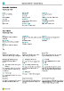

# Arbejd med [!INCLUDE[prod_short](includes/prod_short.md)]

Når du udfører de opgaver, interagerer du med data på forskellige måder, f.eks. når du opretter poster og indtaster data, sorterer og filtrerer data, skriver noter og skriver data til andre programmer.

Du kan f.eks. justere størrelsen og placeringen af en side, udvide bredden af kolonner og øge højden på kolonneoverskrifter og ændre sorteringen af data i kolonner. Og hvis du vil bruge et vandret rullepanel til at få vist alle kolonner på en listeside eller på dokumentlinjer, er der en lodret låst rude, der sikrer, at visse kolonner ikke kan rulles.

[!INCLUDE [about-ui-learn](includes/about-ui-learn.md)]

## Tip

> [!TIP]
> Hvis du vil have vist en printervenlig oversigt over de mest benyttede funktioner, skal du vælge følgende billede og hente PDF-filen.
>
> 

## Links til flere oplysninger

I følgende tabel vises nogle af den generelle funktionalitet med links til emner, hvor de er beskrevet.

> [!NOTE]
> Ud over brugergrænsefladens generelle funktioner, der er beskrevet i dette afsnit, kan du bruge andre generelle funktioner, der er mere forretningsrelaterede. Du kan finde flere oplysninger i [Generelle forretningsfunktioner](ui-across-business-areas.md).

| Hvis du vil  | Skal du se |
| --- | --- |
|Søge efter en bestemt side, rapport, handling, Hjælp-emne eller udvidelse fra partner. |[Søge efter sider og oplysninger med Fortæl mig](ui-search.md) |
|Få et overblik over sider for din rolle og for andre roller, og naviger til sider.|[Søge efter sider med Rollestifinder](ui-role-explorer.md)|
| Filtrere data i visninger, rapporter eller funktioner ved at bruge nogle specialtegn og tegn. |[Sortering af, søgning i og filtrering af lister](ui-enter-criteria-filters.md) |
|Få indblik i de mange generelle funktioner, der hjælper dig med at indtaste data på en hurtig og nem måde.|[Angivelse af data](ui-enter-data.md)|
|Lære, hvordan du hurtigt kan kopiere og indsætte data, herunder ved at bruge tastaturgenveje.|[Ofte stillede spørgsmål om kopiering og indsætning](faq-copy-paste.yml)|
| Få vist eller behandle data i bestemte datointervaller. |[Arbejde med kalenderdatoer og klokkeslæt](ui-enter-date-ranges.md) |
| Se, hvilke felter der skal udfyldes. |[Registrere obligatoriske felter](ui-mandatory-fields.md) |
|Forstå, hvordan computerens internationale indstillinger påvirker brugergrænsefladen og webstedet Hjælp, og hvordan du kan ændre sproget.|[Ændre sprog og landestandard](about-locale-language.md)|
|Lære, hvordan du arbejder med Excel fra næsten hvor som helst i [!INCLUDE[prod_short](includes/prod_short.md)]|[Få vist og redigere i Excel](across-work-with-excel.md)|
|Du kan vedhæfte filer, tilføje links eller skrive noter til kort og dokumenter.|[Administrere vedhæftede filer, links og noter på kort og dokumenter](ui-how-add-link-to-record.md)|
| Ændre grundlæggende indstillinger, f.eks virksomhed, arbejdsdato og rollecenter. |[Ændre grundlæggende indstillinger](ui-change-basic-settings.md) |
|Få besked om bestemte hændelser eller ændringer i status, f.eks. når du er ved at fakturere en kunde, der har en forfaldent beløb.|[Administrere notifikationer](ui-smart-notifications.md)|
| Ændre hvilke elementer i brugergrænsefladen der vises som egnet til dine præferencer og hvor|[Tilpasse dit arbejdsområde](ui-personalization-user.md) |
|Definere, få vist, udskrive eller gemme rapporter og angive og udføre kørsler.|[Arbejde med rapporter, kørsler og XMLporte](ui-work-report.md)|
| Administrere indholdet og formatet af rapporter og dokumenter, herunder hvilke datafelter i et datasæt der vises i rapporten, og hvordan de er organiseret, teksttypografi, billeder og meget mere.|[Administrere rapport- og dokumentlayout](ui-manage-report-layouts.md) |
|Få mere at vide om funktioner og muligheder, der gør [!INCLUDE[prod_short](includes/prod_short.md)] direkte tilgængelig for personer med handicap.|[Tilgængelighedsfunktioner og tastaturgenveje](ui-accessibility.md)|

## Navigation i Business Central
Her er en kort video om, hvordan du bevæger dig rundt i [!INCLUDE[prod_short](includes/prod_short.md)].

> [!VIDEO https://www.youtube.com/embed/zqz03iMihx0]

## Sådan vælger du en desktopbrowser

[!INCLUDE[prod_short](includes/prod_short.md)] understøtter flere browsere, som hver især har mange forskellige funktioner og muligheder. Browseren spiller en vigtig rolle for, hvor hurtigt brugergrænsefladen reagerer og kan bruges. Se listen over understøttede, anbefalede browsere til [Business Central Online](./product-requirements.md) og browsere til [Business Central til det lokale miljø](/dynamics365/business-central/dev-itpro/deployment/system-requirement-business-central-v15).

- Hvis det er muligt, skal du undgå ældre browsere som f.eks. Internet Explorer og skifte til en af vores anbefalede moderne browsere, f.eks. den nye [ Microsoft Edge](https://www.microsoft.com/edge/).  

    Internet Explorer understøttes ikke længere. Du kan få flere oplysninger i [Dokumentation til Microsoft Edge](https://support.microsoft.com/hub/4337664/microsoft-edge-help).
- Sørg for, at din browser altid er opdateret til den nyeste version.

## Handlingslinjer

I [!INCLUDE [prod_short](includes/prod_short.md)] gør du det meste af arbejdet på en liste, et dokument eller et kort. Alle tre typer sider har en linje med aktioner, der er relevante for den pågældende side, og handlingerne er næsten de samme for det enkelte kort eller dokument og for listen over objekter. På den måde kan du administrere en individuel salgsordre på siden **Salgsordre** og på listen **Salgsordrer**, herunder bogføre og fakturere den.  

Men handlingerne kan også se anderledes ud eller heller ikke være til stede, afhængigt af hvordan du åbner siden. Specielt beregnet til listesider er den listeside, du åbner fra hjemmesiden, og på den side, der gengives, når du søger efter den  ikon er ikke ens.  

Når du søger efter en åben listeside, f. eks **Salgsordrer**, vises den i Vis tilstand. De handlinger, der bruges til at redigere, få vist eller slette en individuel enhed, f. eks. en salgsordre, vises, når du vælger handlingen **Administrer**.  

> [!TIP]
> Hvis du ved, at du ofte vil bruge handlinger på dette andet niveau på handlingslinjen, skal du vælge ikonet :::image type="icon" source="media/pin.png" border="false"::: for at fastgøre handlingslinjen og få handlingerne under de forskellige menuer med det samme.
>
> Hvis du vil have andet niveau på handlingslinjen til at forsvinde igen, skal du vælge ikonet :::image type="icon" source="media/unpin.png" border="false":::.

Men når du åbner den samme listeside fra startsiden, er handlingen **Administrer** ikke tilgængelig. I stedet for at åbne en individuel salgsordre skal du blot vælge feltet **Nummer**. I denne visning kan du ikke fastgøre handlingslinjen.  

## Se også

[Blive køreklar](ui-get-ready-business.md)  
[Konfigurere Business Central](setup.md)  
[Generelle forretningsfunktioner](ui-across-business-areas.md)  
[Tip til ydeevne for erhvervsbrugere](/dynamics365/business-central/dev-itpro/performance/performance-users?toc=/dynamics365/business-central/toc.json)

## [!INCLUDE[prod_short](includes/free_trial_md.md)]

[!INCLUDE[footer-include](includes/footer-banner.md)]
